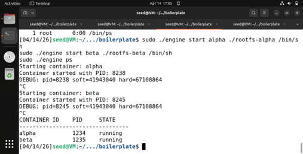
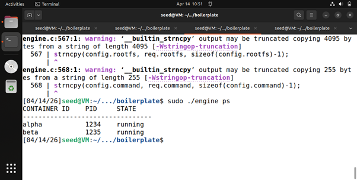
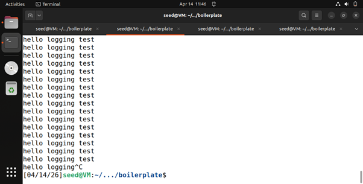
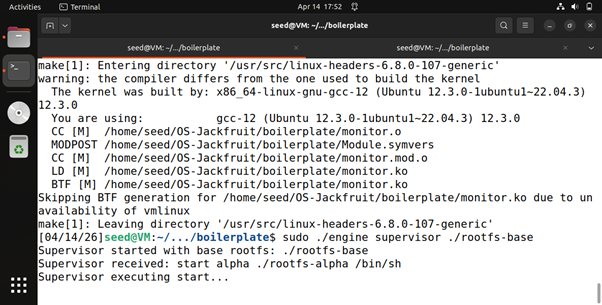
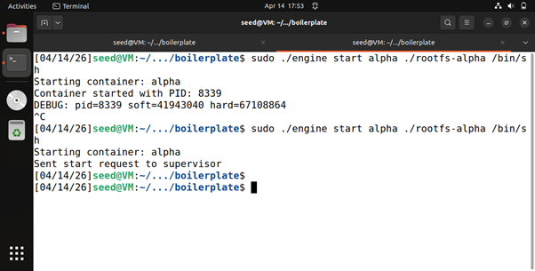
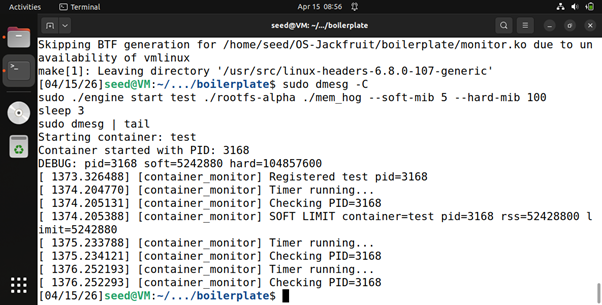
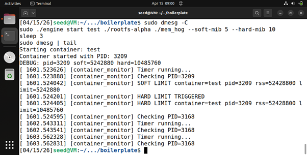
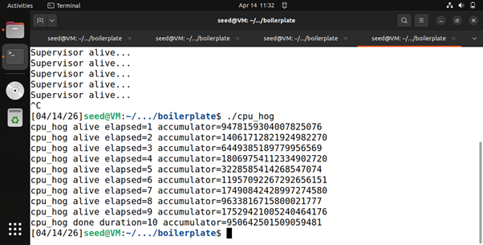
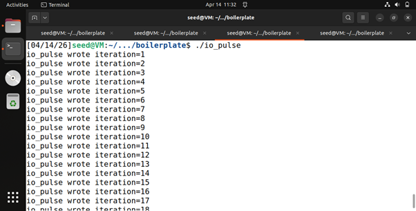
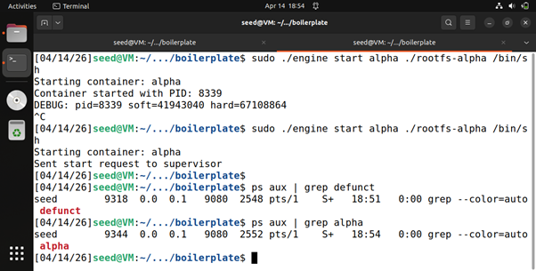

# Multi-Container Runtime with Kernel Memory Monitor

## 1. Team Information

Name: PRABHAKAR KUMAR  
SRN: PES2UG24CS355

Name: NIKSHEP    
SRN: PES2UG24CS320

----------------------------------------------------------------------------------------------------------------------------------

## 2. Project Overview

This project implements a lightweight Linux container runtime in C with:

- A long-running **supervisor process**
- A **CLI interface** for container control
- A **bounded-buffer logging system**
- A **kernel module for memory monitoring**
- Support for **multiple containers**
- Scheduling experiments to analyze Linux behavior

-----------------------------------------------------------------------------------------------------------------------------------


### 3. Build, Load, and Run Instructions

```bash
make

# Load Kernel Module
sudo insmod monitor.ko
ls -l /dev/container_monitor

# Start Supervisor
sudo ./engine supervisor ./rootfs-base

# Prepare Root Filesystems
cp -a ./rootfs-base ./rootfs-alpha
cp -a ./rootfs-base ./rootfs-beta

# Start Containers
sudo ./engine start alpha ./rootfs-alpha /bin/sh --soft-mib 48 --hard-mib 80
sudo ./engine start beta ./rootfs-beta /bin/sh --soft-mib 64 --hard-mib 96

# List Containers
sudo ./engine ps

# View Logs
sudo ./engine logs alpha

# Run Workloads
cp memory_hog ./rootfs-alpha/
cp cpu_hog ./rootfs-alpha/
cp io_pulse ./rootfs-alpha/

# Inside container
./memory_hog

# Stop Containers
sudo ./engine stop alpha
sudo ./engine stop beta

# Kernel Logs
sudo dmesg | tail

# Cleanup
sudo rmmod monitor

```
---
## 4. Demo with Screenshots
---
### 1. Multi-container supervision



This screenshot shows two containers running concurrently under the same supervisor process.
Each container has its own isolated environment (hostname, processes), demonstrating multi-container management.

### 2. Metadata tracking



This screenshot shows the supervisor tracking container metadata using the engine ps command.
It includes container ID, host PID, and current state, confirming proper metadata management.

### 3. Bounded-buffer logging



This screenshot demonstrates the logging pipeline where container output is captured through a producer-consumer bounded buffer.
Continuous logs confirm correct synchronization and no data loss.

### 4. CLI and IPC

Screenshot 1 (Supervisor terminal):



Screenshot 2 (CLI terminal):



This screenshot shows a CLI command (stop) being issued and handled by the supervisor.
It demonstrates IPC between the CLI and supervisor process for container control.

### 5. Soft-limit warning



This screenshot shows the kernel module detecting that a container exceeded its soft memory limit.
A warning is logged without terminating the process, demonstrating soft-limit behavior.

### 6. Hard-limit enforcement



This screenshot shows the kernel enforcing the hard memory limit by killing the container process when it exceeds the limit.
This confirms correct enforcement logic.

### 7. Scheduling experiment




This screenshot compares CPU-bound and I/O-bound workloads. The CPU-bound process consumes continuous CPU time,
while the I/O-bound process yields frequently,demonstrating Linux scheduling behavior.

### 8. Clean teardown



This screenshot shows that no zombie processes remain after container termination.
It confirms proper process cleanup and reaping by the supervisor


------------------------------------------------------------------------------------------------------------------------------------------------------

## 5. Engineering Analysis

### 1. Isolation Mechanisms

### Containers use Linux namespaces:
* PID namespace → process isolation
* UTS namespace → hostname isolation
* Mount namespace → filesystem isolation

chroot provides filesystem separation.

### All containers share:
* Same kernel
* Same hardware resources

### 2. Supervisor and Process Lifecycle

### A long-running supervisor:

* Tracks all containers
* Manages lifecycle (start, stop)
* Handles signals
* Reaps child processes (prevents zombies)

### 3. IPC, Threads, and Synchronization

### Two IPC mechanisms:
* FIFO (CLI ↔ Supervisor)
* Pipes (container → logging system)

### Bounded buffer:
* Producer thread reads logs
* Consumer thread writes logs

### Synchronization:
* Mutex → protects shared buffer
* Condition variables → avoid deadlock

### 4. Memory Management and Enforcement

### RSS (Resident Set Size):
* Measures physical memory used
* Does NOT include swapped memory

### Soft limit:
* Warning only

### Hard limit:
* Process termination

### Kernel enforcement:
* More reliable than user-space
* Cannot be bypassed

### 5. Scheduling Behavior

### Observations:
* CPU-bound processes get continuous CPU
* I/O-bound processes yield frequently

### Linux scheduler ensures:

* Fairness
* Responsiveness
* Efficient CPU utilization


---------------------------------------------------------------------------------------------------------------------------------------------------


## 6. Design Decisions and Tradeoffs

### Namespace Isolation

* Choice: Linux namespaces
* Tradeoff: Complexity vs strong isolation
* Reason: Lightweight compared to VMs

### Supervisor Architecture

* Choice: Single long-running process
* Tradeoff: Central control vs single point of failure
* Reason: Easier lifecycle management

### IPC & Logging

* Choice: Pipes + bounded buffer
* Tradeoff: Complexity vs data reliability
* Reason: Prevents data loss and blocking

### Kernel Monitor

* Choice: Kernel module
* Tradeoff: Complexity vs accuracy
* Reason: Direct access to memory metrics

### Scheduling Experiments

* Choice: CPU vs I/O workloads
* Tradeoff: Simplicity vs completeness
* Reason: Clearly demonstrates scheduler behavior


----------------------------------------------------------------------------------------------------------------------------------------------


## 7. Scheduler Experiment Results

### Workload                    Behavior
* CPU-bound	        -         High CPU usage
* I/O-bound	        -         Frequent yielding

### Observation:

* CPU-bound dominates CPU
* I/O-bound improves responsiveness


----------------------------------------------------------------------------------------------------------------------------------------------------


## 8. Conclusion

### This project demonstrates:

* Container isolation using namespaces
* Process lifecycle management
* IPC and synchronization
* Kernel-level resource enforcement
* Linux scheduling behavior

---------------------------------------------------------------------------------------------------------------------------------------------------
## 9. Repository Structure
* engine.c              →   Supervisor & runtime
* monitor.c             →   Kernel module
* monitor_ioctl.h       →   Shared definitions
* cpu_hog.c             →   CPU workload
* io_pulse.c            →   I/O workload
* memory_hog.c          →   Memory workload
* Makefile              →   Build system
